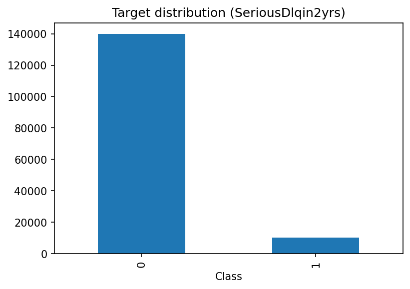
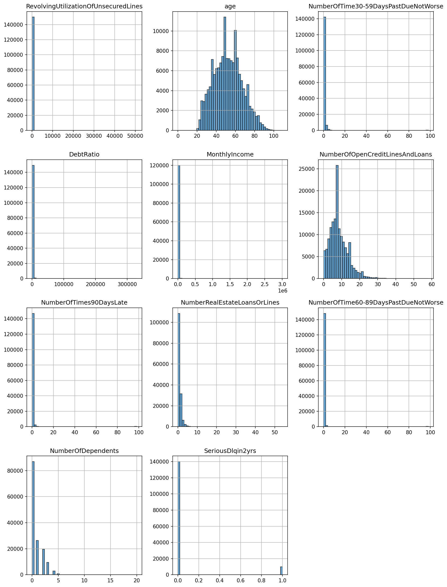
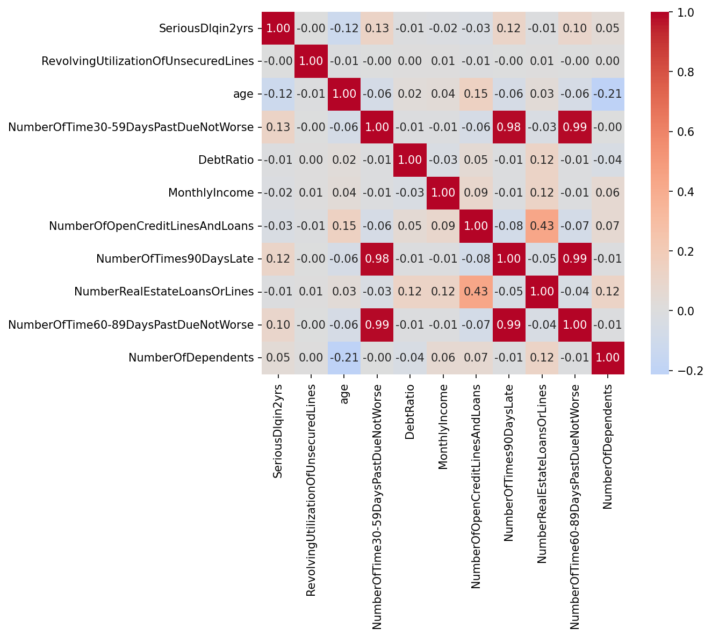

# Документация: Пайплайн кредитного скоринга (GiveMeSomeCredit)

## Описание выполненной работы

**Тип проекта:** учебный/соревновательный кейс с платформы **Kaggle** (competition: [Give Me Some Credit](https://www.kaggle.com/competitions/GiveMeSomeCredit)).

**Цель:** построить production-ready пайплайн бинарной классификации для предсказания риска серьёзной просрочки по кредиту (90+ дней) на основе анкетных и кредитных признаков заёмщика. Результат можно использовать как прототип системы кредитного скоринга в банке или финтехе.

**Что сделано:**
- Полный цикл ML: EDA → предобработка → обучение нескольких моделей → оценка и сравнение → визуализация и сохранение артефактов.
- Модульная структура (отдельные модули под конфиг, EDA, препроцессинг, модели, оценку и графики), конфигурация через dataclasses, логирование и обработка ошибок.
- Четыре модели: логистическая регрессия (baseline), Random Forest, XGBoost, LightGBM с 5-fold кросс-валидацией; выбор лучшей по ROC-AUC и сохранение в `.joblib` вместе со scaler и списком признаков для воспроизводимости на новых данных.

**Полезная информация:**
- **Контекст соревнования:** на Kaggle участники предсказывают целевую переменную `SeriousDlqin2yrs` для тестовой выборки; метрика соревнования — площадь под ROC-кривой (AUC). Данный репозиторий не отправляет предсказания на лидерборд, а фокусируется на воспроизводимом пайплайне и анализе.
- **Бизнес-смысл:** прогноз вероятности «плохого» заёмщика позволяет отсекать или переоценивать риски на этапе выдачи кредита, настраивать лимиты и резервы; интерпретируемость моделей важна для регуляторов и внутреннего контроля.
- **Стек:** Python 3.9+, pandas, numpy, scikit-learn, XGBoost, LightGBM, matplotlib, seaborn, imbalanced-learn (опционально для балансировки классов), joblib для сохранения моделей.
- **Расширение:** при необходимости можно добавить предсказание на официальном тесте Kaggle (`cs-test.csv`), экспорт в форматы для API (ONNX, pickle) или интеграцию в CI/CD; конфиг в `src/config.py` позволяет менять пути, метрики и гиперпараметры без правки кода.

---

## 1. Архитектура проекта

```
creditscoringsystem/
├── data/                    # Датасет (cs-training.csv, cs-test.csv)
├── models/                  # Сохранённые модели (best_model.joblib, scaler.joblib)
├── output/                  # Результаты (метрики, таблицы)
│   └── figures/             # Графики EDA и оценки моделей
├── src/
│   ├── config.py            # Конфигурация (dataclasses)
│   ├── eda.py               # Исследовательский анализ данных
│   ├── preprocessing.py     # Предобработка (пропуски, выбросы, масштабирование)
│   ├── models.py            # Обучение моделей (LR, RF, XGBoost, LightGBM)
│   ├── evaluation.py        # Метрики и сравнение моделей
│   └── visualization.py     # ROC/PR кривые, важность признаков, матрицы ошибок
├── run_pipeline.py          # Точка входа пайплайна
├── requirements.txt
└── documentation.md
```

Пайплайн выполняется последовательно: загрузка данных → EDA → предобработка → разбиение train/test → обучение с кросс-валидацией → оценка на test → визуализация → сохранение лучшей модели и артефактов.

## 2. Описание датасета

**Источник:** [Give Me Some Credit, Kaggle](https://www.kaggle.com/competitions/GiveMeSomeCredit/data)

**Файлы:**
- `cs-training.csv` — обучающая выборка
- `cs-test.csv` — тестовая выборка (опционально для финального прогноза)

**Целевая переменная:**
- `SeriousDlqin2yrs` — бинарная метка: имел ли заёмщик просрочку 90+ дней за 2 года (1 — да, 0 — нет).

**Признаки:**

| Признак | Описание | Тип |
|--------|----------|-----|
| RevolvingUtilizationOfUnsecuredLines | Доля использования необеспеченных кредитных линий | % |
| age | Возраст заёмщика | целое |
| NumberOfTime30-59DaysPastDueNotWorse | Количество просрочек 30–59 дней за 2 года | целое |
| DebtRatio | Отношение ежемесячных долгов к доходу | % |
| MonthlyIncome | Ежемесячный доход | вещественное |
| NumberOfOpenCreditLinesAndLoans | Количество открытых кредитов и займов | целое |
| NumberOfTimes90DaysLate | Количество просрочек 90+ дней | целое |
| NumberRealEstateLoansOrLines | Количество ипотечных/залоговых кредитов | целое |
| NumberOfTime60-89DaysPastDueNotWorse | Количество просрочек 60–89 дней за 2 года | целое |
| NumberOfDependents | Количество иждивенцев | целое |

**Особенности:** есть пропуски в `MonthlyIncome` и `NumberOfDependents`; возможны экстремальные значения (выбросы) в числовых признаках.

## 3. Результаты EDA

После запуска пайплайна в `output/figures/` сохраняются:

- **feature_distributions.png** — распределения числовых признаков (гистограммы).
- **target_distribution.png** — распределение целевой переменной (часто дисбаланс в пользу класса 0).
- **correlation_heatmap.png** — тепловая карта корреляций между признаками и целевой переменной.

### Демонстрация графиков EDA

**Распределение целевой переменной (SeriousDlqin2yrs)** — сильный дисбаланс классов: класс 0 (без серьёзной просрочки) встречается примерно в 14 раз чаще класса 1.



**Распределения признаков** — большинство признаков имеют правостороннюю асимметрию и пик около нуля; возраст ближе к нормальному распределению; целевая переменная бинарна.



**Тепловая карта корреляций** — высокая мультиколлинеарность между признаками просрочек (30–59, 60–89, 90+ дней); целевая переменная сильнее всего связана с этими признаками и отрицательно — с возрастом.



В логах выводятся:
- Таблица пропусков по столбцам (количество и доля).
- Таблица выбросов по столбцам (метод IQR, 1.5 × IQR).

Интерпретация:
- Сильная корреляция между признаками просрочек (30–59, 60–89, 90+ дней) ожидаема.
- Высокие доли пропусков в `MonthlyIncome` и `NumberOfDependents` обосновывают заполнение медианой/модой.
- Выбросы в доходе и долговой нагрузке обосновывают каппинг по квантилям.


## 4. Сравнение моделей и метрики

В пайплайне обучаются и оцениваются четыре модели:

1. **Logistic Regression** — baseline, интерпретируемость.
2. **Random Forest** — ансамбль деревьев, устойчивость к выбросам и нелинейностям.
3. **XGBoost** — градиентный бустинг, часто высокое качество на табличных данных.
4. **LightGBM** — градиентный бустинг с быстрым обучением.

**Метрики на тестовой выборке:**
- ROC-AUC, Precision-Recall AUC
- Accuracy, Precision, Recall, F1-score

**Артефакты:**
- `output/metrics_comparison.csv` — таблица метрик по всем моделям.
- `output/figures/roc_curves.png` — ROC-кривые всех моделей на одном графике.
- `output/figures/precision_recall_curves.png` — Precision-Recall кривые.
- `output/figures/feature_importance_<model>.png` — важность признаков по каждой модели.
- `output/figures/confusion_matrices.png` — матрицы ошибок по моделям.

Лучшая модель по ROC-AUC на кросс-валидации сохраняется в `models/best_model.joblib`. Дополнительно сохраняются `scaler.joblib` и `feature_columns.joblib` для применения пайплайна к новым данным.

## 5. Инструкция по запуску

**Требования:** Python 3.9+

**Установка зависимостей:**
```bash
pip install -r requirements.txt
```

**Подготовка данных:**
1. Скачайте датасет с [Kaggle Give Me Some Credit](https://www.kaggle.com/competitions/GiveMeSomeCredit/data).
2. Положите файл `cs-training.csv` в папку `data/` в корне проекта:
   ```
   creditscoringsystem/data/cs-training.csv
   ```

**Запуск пайплайна:**
```bash
python run_pipeline.py
```

Из корня проекта (где лежит `run_pipeline.py`) выполнение идёт в порядке: EDA → предобработка → обучение с 5-fold CV → оценка на отложенной выборке → построение графиков → сохранение лучшей модели и артефактов. Логи выводятся в stdout.

**Результаты:**
- Графики и таблицы — в `output/` и `output/figures/`.
- Модель и препроцессор — в `models/`.
